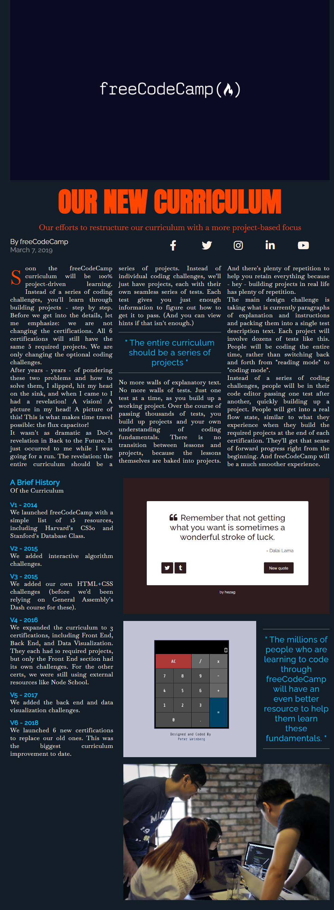

# A Magazine webpage

> A Magazine Webpage built using CSS grid,including concept like grid rows and grid columns.



## Built With

- CSS Properties:

::before,
::after; `padding`, `margin`, `box-sizing`,

main: `display`, `grid-template-columns`, `row-gap`,

.heading: `grid-column`, `display`, `grid-template-columns`

- Linters
  - [Prettier](https://prettier.io/),
  - [Stylelint](https://stylelint.io/).
- GitHub Action

## Live Demo

[Live Demo Link](https://oladele-15-fcc-city-skyline.netlify.app/)

### Development (Running locally)

- Clone the project

```bash
git clone git@github.com:olayinka-oladele/16-fcc-magazine.git

```

- Install Dependencies

```bash
yarn install
```

To run StyleLint by itself, you may run the lint task:

```bash
yarn lint:check
```

Or to automatically fix issues found (where possible):

```bash
yarn lint
```

You can also check against Prettier:

```bash
yarn format:check
```

and to have it fix (to the best of its ability) any format issues, run:

```bash
yarn format
```

You can also check against Webhint:

```bash
yarn hint
```

## Style Guides

- [CSS Style Guide](http://udacity.github.io/frontend-nanodegree-styleguide/css.html)
- [HTML Style Guide](http://udacity.github.io/frontend-nanodegree-styleguide/index.html)
- [Git Style Guide](https://udacity.github.io/git-styleguide/)

## 👤 Author

- Github: [@olayinka-oladele](https://github.com/olayinka-oladele)
- Freecodecamp: [@olayinka-oladele](https://freecodecamp.com/author)
- Linkedin: [@olayinka-oladele](https://www.linkedin.com/in/author/)

## 🤝 Contributing

Contributions, issues and feature requests are welcome!

Feel free to check the [issues page](../../issues).

## Show your support

Give a ⭐️ if you like this project!

## Acknowledgments

- [freecodecamp](https://www.freecodecamp.org/learn/2022/responsive-web-design/learn-css-grid-by-building-a-magazine/step-80)

## 📝 License

[MIT licensed](./LICENSE).
